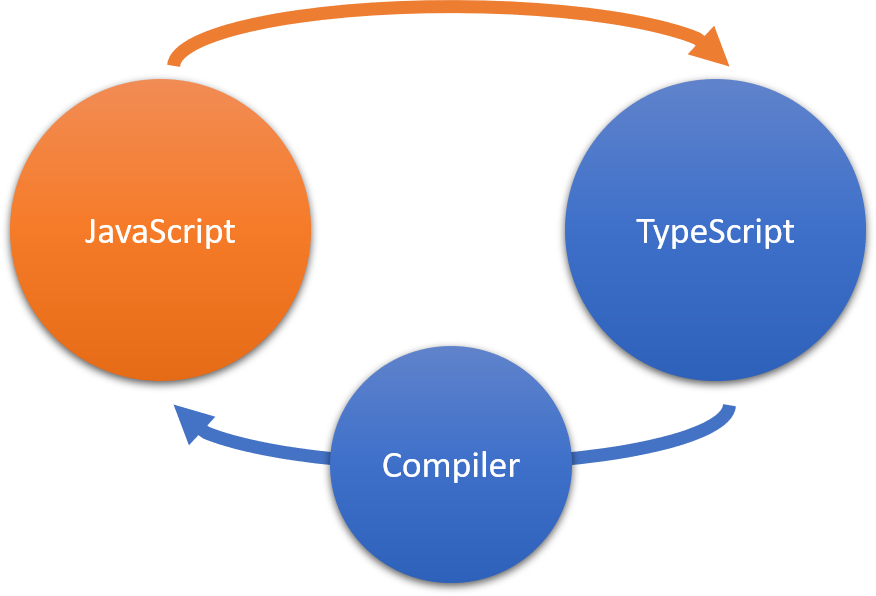

JavaScript, one of the world's most used tools, has become the official language of the web, enabling developers to write cross-platform applications that can run on any platform and in any browser.

But while JavaScript is the only way to create cross-platform apps, it wasn't conceived for large apps involving thousands, or even millions of lines of code. JavaScript lacks some of the features of more mature languages that power today's sophisticated integrated development editors (IDEs) so it can be difficult to maintain these large code bases.

TypeScript addresses the limitations of JavaScript but does so in a way that doesn't compromise the key value proposition of JavaScript: the ability to run your code anywhere and on every platform, browser, or host.

## **What is TypeScript?**

TypeScript is an open-source language, developed by Microsoft, that builds on JavaScript by adding optional *static type definitions*.

### Types

Types provide a way to describe the shape of an object, providing better documentation, and allowing TypeScript to validate that your code is working correctly. Through static type checking, TypeScript catches issues with your code early during development that normally can't be caught in JavaScript until code is run in the browser. Types also enable you to describe what your code does, so if you're working on a team, someone who comes after you will understand it.

Types also power the intelligence and productivity benefits of development tools, like Intellisense, symbol-based navigation, go to definition, find all references, statement completion, and code re-factoring.

Writing types can be optional in TypeScript, because *type inference* allows you to get a lot of power without writing additional code. TypeScript’s type inference means that you don’t have to annotate your code with types until you want more safety.

### Try it! Learning about types

Let's look at a simple example to demonstrate the use of types.

1. Open the TypeScript [Playground](https://www.typescriptlang.org/play). (You'll learn more about the Playground later in this module.)
2. Copy and paste the following JavaScript code sample into the TypeScript (left) pane of the Playground:

    ```javascript
    function addNumbers(num1, num2) {
      return num1 + num2;
    }

    console.log(addNumbers(3, 6));
    ```

3. Notice that the same code appears in the **JS** pane on the right side. This is the JavaScript code that TypeScript will generate after it's compiled.
4. Select **Run** to execute the JavaScript code. Then, select the **Logs** tab and notice that the value `9` is logged to the console. JavaScript has assigned the `number` type to the parameters `num1` and `num2` and the function returned a number.
5. Now, replace `3` with `"three"` in the TypeScript code and then run it. JavaScript now assigns the `string` type to the `num1` parameter and returns "three6", a string type, to the console. You've probably run into this situation before and, as you know, it can cause some unexpected results.
6. In the TypeScript pane, notice the red squiggly lines under the parameter names in the `addNumbers` function. This indicates that the type checker identified errors. Position your mouse pointer over one of the parameters and read the description of the error. TypeScript has implicitly assigned a type of `any`, which is the broadest type because it can essentially contain anything.
7. Now, update the TypeScript code to specify a type for each parameter. Replace `num1` with `num1: number` and `num2` with `num2: number`.
8. You'll notice that the errors are now gone from the parameters, but a new one has appeared under the first argument in the function call: **Argument of type 'string' is not assignable to parameter of type 'number'**.
9. Replace `"three"` with a number to correct the error. You could pass in a literal value, a variable, or any other data and, because TypeScript understands the shape of your object, it can notify you of the type conflict at development time.
10. Review the JavaScript and notice that there are no changes to it. TypeScript was able to provide type checking during development, but this has had no impact on the resulting JavaScript code because it doesn't support types.

### Other code features of TypeScript

TypeScript has additional coding features that you won't find in JavaScript:

- Interfaces
- Namespaces
- Generics
- Abstract classes
- Data modifiers
- Optionals
- Function overloading
- Decorators
- Type utils
- readonly keyword

You'll learn more about some of these features in later modules.

## TypeScript compatibility with JavaScript

TypeScript is a strict superset of [ECMAScript 2015](https://www.ecma-international.org/ecma-262/6.0/) (ECMAScript 6 or ES6). This means that all JavaScript code is also TypeScript code, and a TypeScript program can seamlessly consume JavaScript.

Browsers only understand JavaScript, so when you write your application in TypeScript, you need to compile your code and convert it to JavaScript for your application to work. TypeScript code is transformed into JavaScript code using the TypeScript compiler or a TypeScript-compatible transpiler. The resulting JavaScript is clean, simple code that runs anywhere JavaScript runs: In a browser, on Node.JS, or in your apps.




### Migrating from JavaScript to TypeScript

Adopting TypeScript is not a binary choice, so you can gradually migrate your codebase. You can start by annotating existing JavaScript with [JSDoc](https://jsdoc.app/), then switch a few files to be checked by TypeScript, and over time prepare your codebase to convert completely.

For more information about this process, see [TypeScript Tutorials: Migrating from JavaScript](https://www.typescriptlang.org/docs/handbook/migrating-from-javascript.html).
