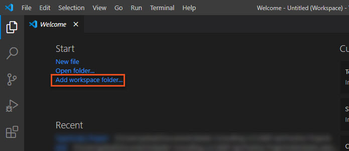
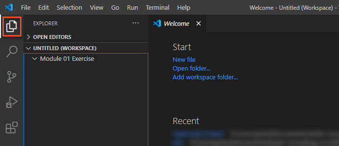
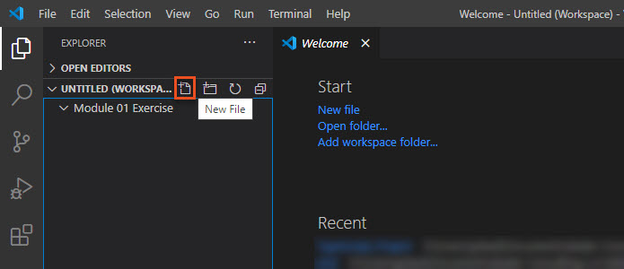
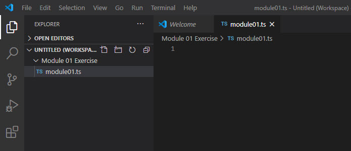
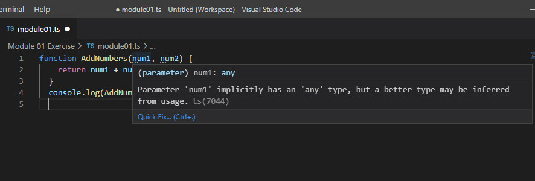

# Exercise - Setup a TypeScript project #

In this exercise, you’ll create a new TypeScript project. You'll then confirm that your development environment is set up correctly by running the compiler and verifying that the JavaScript file is generated.

## Step 1: Set up a new TypeScript project in VS Code

Create a new project workspace in VS Code and initialize the project.

1. Open VS Code.

2. On the Welcome screen, select **Add workspace folder**.




3. Create a new project folder and then select **Add**.

4. Select the **Explorer** icon.




5. In the Explorer, select the **New File** icon.




6. Type the file name `module01.ts` and press **Enter**. The TypeScript file appears in a new code editor.




## Step 2: Generate a `tsconfig.json` file

The TypeScript compiler applies default behavior when you compile TypeScript source code. But you can modify the TypeScript compiler options by adding a `tsconfig.json` file to the root of your TypeScript project folder. This file defines the TypeScript project settings, such as the compiler options and the files that should be included.

You can use the `init` option of the TypeScript compiler to generate a TSConfig file with default options.

1. In VS Code, open a new terminal window by selecting **Terminal** > **New Terminal**.

1. At the command prompt, enter `tsc --init`.

1. Notice that the new `tsconfig.json` file has been added to the Explorer. (You may need to refresh the Explorer to see the file.)

1. Open the `tsconfig.json` file in the code window. You'll see it has many options, most of which are commented out. Review the description of each enabled option.

1. Update the options in the `tsconfig.json` file so the compiler saves all JavaScript files to a new folder.

   1. In the Explorer, create a new folder in your project called `build`.

   1. In the `tsconfig.json` file, locate the `outDir` option, remove the comment, and set the parameter to `"build`".

   1. Save `tsconfig.json`.

   1. At the command prompt, enter `tsc`. This resets the options for the project.

To learn more about the `tsconfig.json` file, visit the [TSConfig Reference](https://www.staging-typescript.org/tsconfig).

## Step 3: Compile TypeScript to JavaScript

Let's add some JavaScript code to the TypeScript file and then compile it.

1. Copy and paste the following JavaScript code into the `module01.ts` editor.

```javascript
function AddNumbers(num1, num2) {

  return num1 + num2;

}

console.log(AddNumbers(3, 6));

```

2. Notice that even though you haven't yet compiled the code, VS Code has used its built-TypeScript support to type check it. As before, there are type errors in the two parameters of the `AddNumbers` function.




3. Save the TypeScript file. The TypeScript compiler only works on the saved version of the file.

1. Open a new terminal by selecting **Terminal**, **New Terminal**.

1. At the Terminal command prompt, enter `tsc module01.ts`. The compiler should run without errors.

1. Notice that a new JavaScript file has been added to the `build` folder in the Explorer. (You may need to refresh the Explorer to see the file.)

1. Open the `module01.js` file and then select the **Split Editor Right** icon in the upper right corner of VS Code to open a new editor view. You should now be able to see the .ts and .js files side by side and that they are identical.

1. Update the TypeScript code to specify a type for each parameter. Replace `num1` with `num1: number` and `num2` with `num2: number`.

1. Save the file and then run the compiler again. What do you notice about the JavaScript file?

1. At the Terminal command prompt, enter `node module01.js`. This will run the JavaScript and display the result in the console log.

## Step 4: Add an HTML file

As a final step, add an HTML file to the project so you can run and test the JavaScript code.

1. In the Explorer, select the **New File** icon.

1. Type the file name `module01.html` and press **Enter**. The HTML file appears in a new code editor.

1. Copy and paste the following HTML into the editor and then save the file.

```html
<!DOCTYPE html>

<html lang="en" dir="ltr">

<head>

    <meta charset="UTF-8">

    <title>Test JavaScript</title>

</head>

<body>

    <h1>Test JavaScript</h1>

  <p id="date"></p>

  <p>This page calls the script module01.js and is used for testing.</p>

  <script src="module01.js"></script>

  <noscript>You need to enable JavaScript to view the full site.</noscript>

</body>

</html>

```

4. In the Explorer, right-click `module01.html` and select **Open in Default Browser**.

1. Activate the Developer Tools for your browser and you are ready to start coding in TypeScript!

