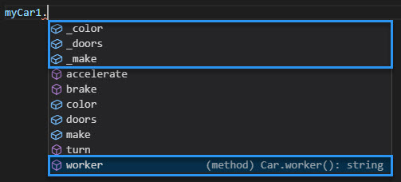

All class members are `public`, by default. This means that they are accessible from outside of the containing class. You saw an example of this earlier when you returned the value of two members of the `Car` class: `_color` (a property defined in the class) and `color` (a parameter defined in the `constructor`.) Sometimes it is desirable to provide access to both, but you will typically want to control access to the raw data contained in the property by only allowing access through the `get` or `set` accessor.

You can also control access to method functions. For example, the `Car` class contains a function called `worker` that is only called from other method functions within the class. Calling this function directly from outside of the class may cause undesirable results.

In TypeScript, you can control the visibility of class members by adding the `public`, `private`, or `protected` keyword before the member name.

| Access modifier| Description|
| :--- | :--- |
| `public`| If you don't specify an access modifier, the default is public. You can also explicitly set the member to public by using the `public` keyword.|
| `private`| If you modify the member with the `private` keyword, it cannot be accessed from outside of its containing class.|
| `protected`| The `protected` modifier acts much like the `private` modifier with the exception that members declared `protected` can also be accessed within deriving classes. (You'll learn more about this later in the module.)|

In addition, properties can be made `readonly` by using the readonly modifier. Readonly properties may only be set when initialized at their declaration or in the `constructor`.


Continue defining the `Car` class in the Playground.

1. Test the access of the class members by typing `myCar1.` and notice that all the members appear in the list, including the properties, the `constructor` parameters, the methods, and the `worker` function.

    

1. Set the access modifier of the `_color`, `_doors`, and `_make` properties and the `worker` function to `private`.

    ```typescript
    // Properties
    private _make: string;
    private _color: string;
    private _doors: number;
    // ...
    private worker(): string {
        return this._make;
    }
    ```

1. Test the access of the class members again by typing `myCar1.` and notice that the properties and the `worker` function are now unavailable. Any attempt to use these class members will raise an error at compile time.

    

> [!NOTE]
> TypeScript is a structural type system. When you compare two different types, regardless of where they came from, if the types of all members are compatible, then we say the types themselves are compatible. However, when comparing types that have private and protected members, these types are treated differently. For two types to be considered compatible, if one of them has a private member, then the other must have a private member that originated in the same declaration. The same applies to protected members.
