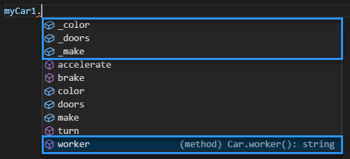
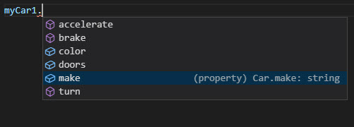

In this exercise, you'll apply access modifiers to properties and methods of the `Car` class.

1. Continue defining the `Car` class in the Playground.
1. Test the access of the class members by typing `myCar1.` and notice that all the members appear in the list, including the properties, the `constructor` parameters, the methods, and the `worker` function.

    

1. Set the access modifier of the `_color`, `_doors`, and `_make` properties and the `worker` function to `private`.

    ```typescript
    // Properties
    private _make: string;
    private _color: string;
    private _doors: number;
    // ...
    private worker(): string {
        return this._make;
    }
    ```

1. Test the access of the class members again by typing `myCar1.` and notice that the properties and the `worker` function are now unavailable. Any attempt to use these class members will raise an error at compile time.

    
