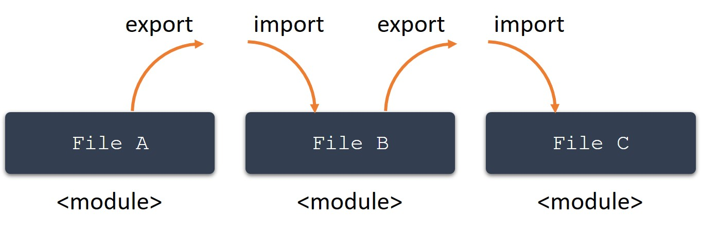

Like namespaces, **modules** provide a way to organize and categorize your code, enabling you to group related code together. Also, when code is inside a module, it is pulled from the global scope and into the scope of the module. This can help you avoid naming conflicts between components in the global namespace.

> [!TIP]
> Modules have been a feature of JavaScript since ES6, so they are also supported by TypeScript. Before ES6, earlier versions of TypeScript referred to modules as "external modules".

You can export any declaration (such as a variable, function, class, type alias, or interface) by adding the `export` keyword or import it by using the `import` keyword. Any file containing a top-level `import` or `export` statement is considered a module.

The `export` statement explicitly makes a component in one module available to other modules, while the `import` statement allows you to consume that component from another module. Modules are declarative; the `import` and `export` statements at the file level describe the relationships between them.

Returning to the greetings example in the earlier units, how can this scenario be implemented as modules instead of namespaces? Recall that the example includes two functions called `returnGreeting` that each perform different tasks, plus a helper function called `getLength` that's used by one of the `returnGreeting` functions. Let's see what this scenario looks like implemented as modules.

> [!NOTE]
> To implement modules, you need to use an IDE. This is not possible to do this in the Playground. See the Lab setup section later in this module for more information about setting up a development environment in Visual Studio Code.
